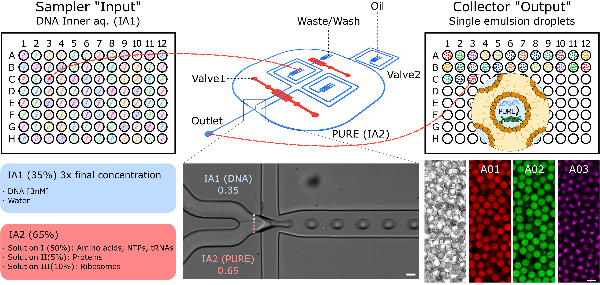

<h1 align="center">PUREdrop</h1>

<i>Code for the paper <b>"Automated Synthetic Cell-based Screening for Designed Proteins with Emergent Functions"</b> by Kareem Al Nahas, Béla P. Frohn, Aleksandra Šakanović, Frank Siedler and Petra Schwille (<a href="https://www.nature.com/articles/s41467-026-76787-8">Nature Communications</a>)

    

## Abstract
Designing minimal biological systems with emergent functions generated by protein spatiotemporal self-organization is a central goal of bottom-up synthetic biology. While computational optimization and design show promises to accelerate functional protein engineering through Design-Build-Test-Learn cycles, screening libraries for emergent functions remains a major challenge. Conventional screens typically lack the spatiotemporal resolution and cell-like confinement required in bottom-up synthetic biology. Here, we present PUREdrop, an automated microfluidic platform that encapsulates and expresses protein libraries in thousands of picolitre-sized synthetic cells per construct. These droplets are sorted into a 96-well plate and analyzed by time-lapse imaging, allowing parallel quantification of expression kinetics and emergent functions. As a proof of concept, we screened 48 computationally re-designed variants of the bacterial cell division protein FtsZ, identifying variants with improved bundling phenotypes and faster kinetics. PUREdrop bridges computational protein engineering and synthetic cell research, elevating the rational engineering of complex biological function to the next level.

## Repository Structure
The repository contains five directories: 
- [PUREdrop](link): Contains code and edited ACQpack package for running the automated microfluidic platform as described in the paper. The jupyter notebook "PUREdrop" guides the experimenter through the chip setup, calibration, simple testing and the full-automated run. 
- [ProteinReDesign](link): The code used to generate FtsZ sequences. Available as Google Colab, such that it can be run without local installment on [Google Colab](https://colab.research.google.com). Can also be used to re-design other proteins. 
<!-- 
- [Data](link): 
- [Analysis](link): 
-->
